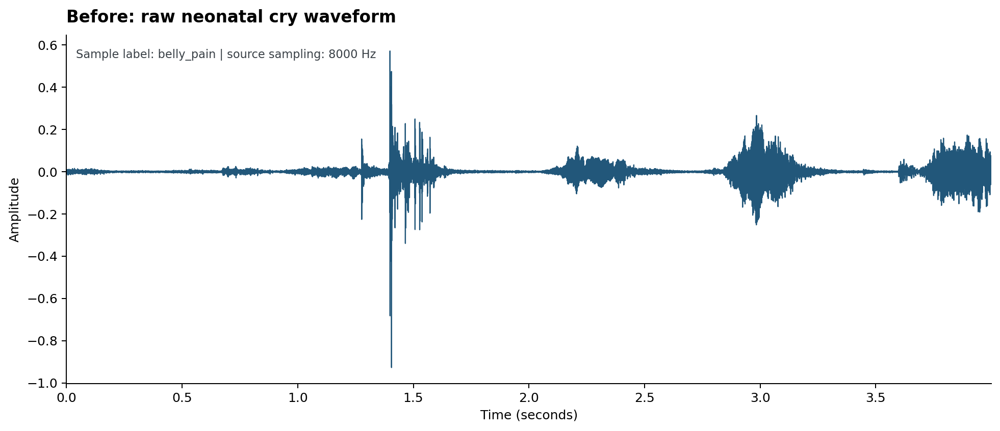
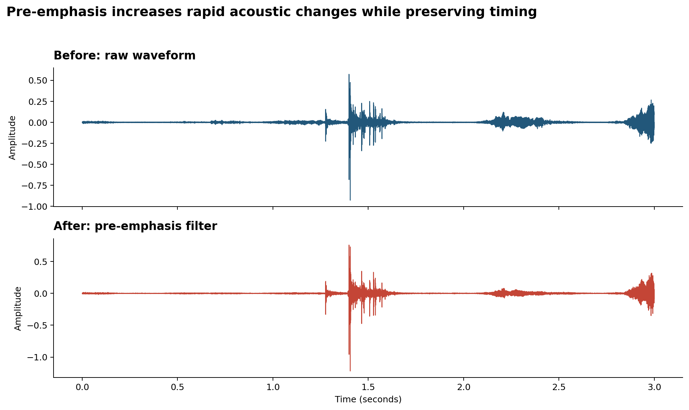
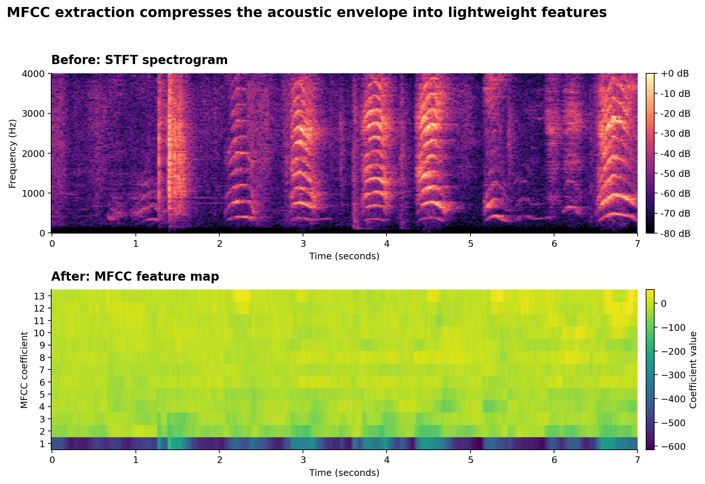
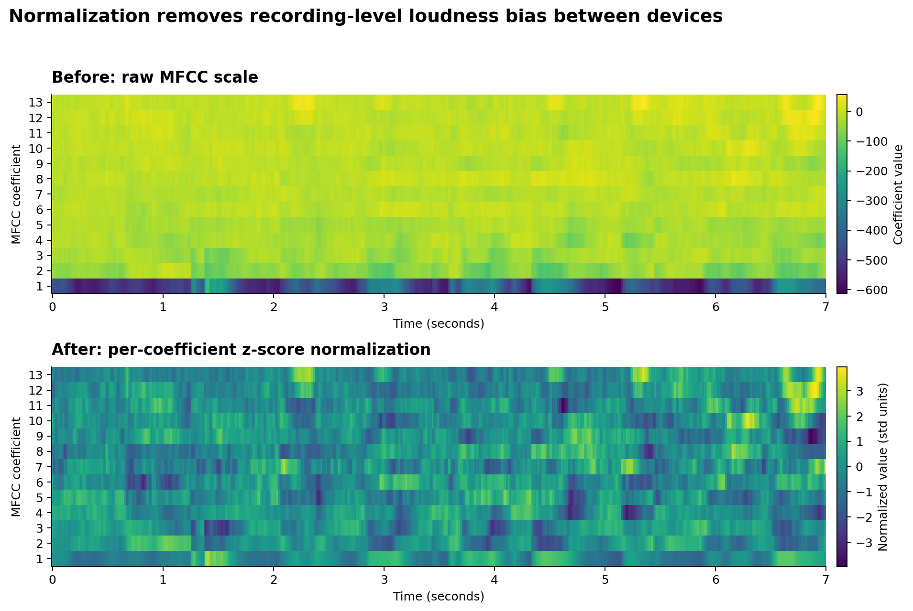
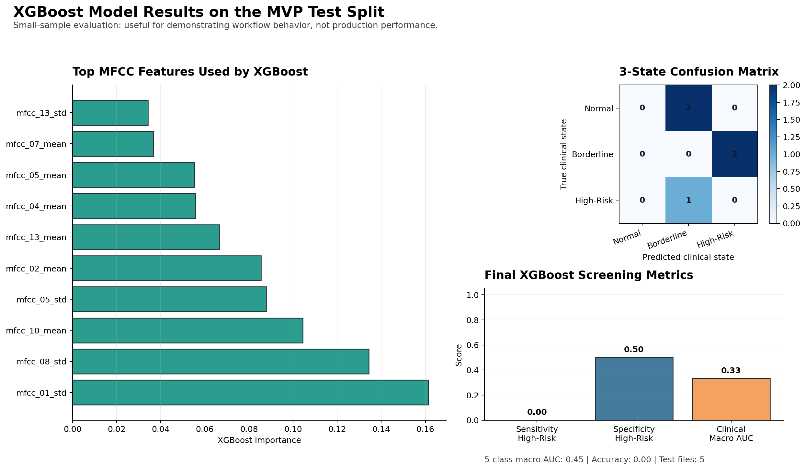

# CryFlag - Neonatal Cry Acoustics Clinical AI Decision Support


[](https://colab.research.google.com/github/asafa3-cmyk/Neonatal-Cry-Acoustics/blob/main/Asaf_Asnin_Neonatal_Cry_AI_MVP.ipynb)
[](https://mybinder.org/v2/gh/asafa3-cmyk/Neonatal-Cry-Acoustics/main?filepath=Asaf_Asnin_Neonatal_Cry_AI_MVP.ipynb)

If the interactive buttons above are slow to start, view the notebook with all outputs already rendered here: [nbviewer](https://nbviewer.org/github/asafa3-cmyk/Neonatal-Cry-Acoustics/blob/main/Asaf_Asnin_Neonatal_Cry_AI_MVP.ipynb).

An end-to-end medical AI MVP by **Asaf Asnin** that transforms neonatal cry recordings into lightweight acoustic features, trains a CPU-friendly XGBoost model, and maps model probabilities into a simple 3-state clinical support output.

The goal is not to build a heavy model. The goal is to demonstrate the reasoning and engineering behind a responsible medical AI product: clear clinical framing, reproducible data handling, transparent preprocessing, simple modeling, and **honest, pre-registered evaluation** — including reporting plainly that this MVP does not yet meet its own success criteria, and explaining exactly why.

> **Live notebook:** [`Asaf_Asnin_Neonatal_Cry_AI_MVP.ipynb`](Asaf_Asnin_Neonatal_Cry_AI_MVP.ipynb) — the first cell auto-clones this repo and installs dependencies if run on Colab/Binder, then runs top-to-bottom on CPU in seconds.

## Clinical Problem

Newborn crying can indicate routine needs, mild distress, or stronger pain/stress signals. In busy neonatal care settings, nurses need fast screening support that can help flag cries that may deserve closer attention.

**CryFlag** explores neonatal cry acoustics as a decision-support tool for screening possible pain/stress patterns from short audio clips.

Target workflow: **Screening / Decision Support**

Target user: **Nurse or clinical staff member**

Input: a short mono WAV recording (~7 seconds, 8 kHz).

Final output — never a bare probability, always a human-readable clinical flag:

1. **Normal**
2. **Borderline–Suspicious**
3. **High-Risk**

## What This Repository Demonstrates

- Public, accessible audio data from the Donate-a-Cry corpus (40 files, the corpus's balanced maximum).
- Deterministic data acquisition and metadata generation, with an explicit, documented data-leakage check.
- A 5-step preprocessing pipeline: pre-emphasis, STFT spectrogram, MFCC extraction, per-coefficient normalization, and a documented "resampling not required" decision.
- Before/after plots for every preprocessing step.
- Three models compared: XGBoost (primary), MLP (secondary), and a DummyClassifier sanity-check floor.
- Numeric success criteria **pre-registered before results were computed**, followed by an honest pass/fail verdict — stated plainly, not softened.
- A multi-seed stability sweep, per-example error analysis, and a Gaussian-noise robustness check.
- A short literature review connecting CryFlag's design choices to 3 peer-reviewed papers on cry-based acoustic screening.
- A clinical 3-state output layer designed for screening support.
- A polished, author-named MVP notebook that runs top-to-bottom on CPU and documents all four mandated course stages.

## Final Notebook

The main deliverable is:

```text
Asaf_Asnin_Neonatal_Cry_AI_MVP.ipynb
```

The notebook is structured as a complete clinical product story:

- **Executive Summary**: CryFlag product overview, target user, input, output, and clinical workflow.
- **Stage 1**: clinical problem, product specification, user flow, and functional/non-functional requirements.
- **Stage 2**: dataset source, preprocessing rationale, before/after visual evidence, and the data-leakage limitation check.
- **Stage 3**: XGBoost vs. MLP vs. Dummy comparison, pre-registered success criteria, multi-seed stability sweep, metric selection, 3-state threshold logic, error analysis, and a robustness check.
- **Stage 4**: MVP completion checklist and an honest, unsoftened results summary.

It contains 31 cells (the first is a Colab/Binder setup cell that clones the repo and installs dependencies only if needed — it's a no-op when run locally inside an already-cloned repo), uses fixed seed `42` as the primary reproducible run, and runs top-to-bottom on a laptop CPU in seconds.

## Data Source

Dataset: [Donate-a-Cry Corpus](https://github.com/gveres/donateacry-corpus)

Local sample used in this MVP:

| Property | Value |
|---|---:|
| Audio files | 40 |
| Labels | 5 |
| Files per label | 8 |
| Source sample rate | 8,000 Hz |
| Channels | Mono |
| Mean duration | 6.92 seconds |
| Split | 30 train / 5 validation / 5 test |

This is a deliberately small classroom MVP sample — **8 files per label is the maximum balanced size the public Donate-a-Cry corpus supports**, since the `burping` label only has 8 files total in the source repository. The sample was increased from an initial 20 files (4/label) to this 40-file maximum during a later review pass; see [`project_development_log.md`](project_development_log.md) for the full history.

**Why GitHub instead of Kaggle/PhysioNet:** the dataset is hosted on a public GitHub repository rather than the platforms named as examples in the course brief. It still satisfies the "public + accessible, license documented" requirement: it is openly downloadable via `raw.githubusercontent.com` with no account or paywall, and it carries an explicit ODbL (database) / DbCL (contents) license — the same accessibility bar Kaggle/PhysioNet datasets are held to, just on a different public platform.

**Known limitation — data leakage risk.** Donate-a-Cry filenames expose an uploader/device UUID but **no persistent child identifier**. A check across the 40 sampled files (grouping by the leading UUID segment of the filename) found **3 device IDs whose recordings span more than one split** — e.g. one `belly_pain` recording's device ID appears in both `train` and `test`. Because the source corpus does not expose a real child ID, we cannot rule out the same infant appearing in both splits. This is documented as an **inherent limitation of the public source data** — not something this project caused or could fix without fabricating an identifier the corpus doesn't provide. See the corresponding check cell in Stage 2 of the notebook.

## Visual Data Pipeline

### 1. Raw Neonatal Cry Waveform



The raw waveform shows how the cry arrives as a time-domain signal: bursts, pauses, and amplitude changes over seconds. This is the starting point before any machine learning feature extraction.

### 2. Before/After: Pre-Emphasis Filter



Pre-emphasis balances the acoustic spectrum by highlighting fast changes in the cry signal. This helps make sharp cry events and harmonic structure more visible before spectral analysis.

### 3. Before/After: STFT Spectrogram


The STFT spectrogram converts the waveform into a time-frequency view. Instead of only seeing "how loud" the cry is, we can inspect where energy appears across frequency bands over time.

### 4. Before/After: MFCC Feature Map



MFCC extraction compresses the spectrogram into a compact acoustic representation. This keeps the model lightweight while preserving useful information about the cry's spectral envelope.

### 5. Before/After: Per-Coefficient Normalization



Each MFCC coefficient is z-scored across time before pooling, removing recording-level loudness bias (microphone gain, distance from the infant) so the model compares cry *shape* rather than cry *volume* — volume alone is not a clinically meaningful signal.

**Resampling — Not Required.** All 40 sampled files are already 8 kHz mono. `preprocess.check_resampling_required()` explicitly verifies this against the target rate before deciding to skip resampling — an auditable decision rather than a silently omitted step.

### 6. Sample Class Balance


The MVP sample is intentionally balanced: eight files from each corpus label — the maximum balanced size available from the source corpus. This makes the pipeline easy to inspect and keeps the notebook fast enough for CPU execution.

## Model Architecture & Results

The model layer uses engineered MFCC features:

- 13 MFCC means
- 13 MFCC standard deviations
- 26 total acoustic features per audio file (post z-score normalization)

Three models are compared:

| Model | Role | Why Included |
|---|---|---|
| **XGBoost** | Primary model | Strong fit for small tabular feature sets, fast CPU training, built-in feature-importance for clinical interpretability |
| **MLP** | Secondary model | The deliberate, argued substitute for the originally-proposed 1D CNN — see below |
| **DummyClassifier** | Sanity-check floor | Majority-class guess; not a real candidate, just proof the real models beat blind guessing |

**Why MLP instead of the originally-proposed 1D CNN:** (1) PyTorch/TensorFlow are outside this project's declared minimal-dependency, CPU-only stack; (2) a 1D CNN's core advantage — learning temporal patterns from a raw or lightly-processed signal — doesn't apply here, because Stage 2 already pools each MFCC coefficient into a mean/std pair, destroying the time axis a CNN would convolve over; (3) once that pooling happens, a small feed-forward network *is* what a 1D CNN degenerates into on this feature representation, making `MLPClassifier` the correct like-for-like substitute rather than an arbitrary swap.

XGBoost is selected as the primary model because it is practical for small engineered-feature datasets, trains in seconds on a laptop CPU, and exposes feature importances for clinical interpretability.

### XGBoost Result Visual



This figure shows the final modeling stage: the top MFCC features used by XGBoost, the 3-state confusion matrix, and the final screening metrics on the held-out test split.

### Multi-Seed Stability Sweep

`seed=42` is the primary, fully reproducible run used everywhere else in this project. To check how much a single seed's numbers can be trusted given the tiny (30-sample) training set, both models were also retrained across 5 additional seeds (0–4). Actual output from the notebook:

| Model | Accuracy (mean ± std, range) | Macro AUC (mean ± std, range) |
|---|---|---|
| XGBoost | 0.20 ± 0.00 (0.20 – 0.20) | 0.50 ± 0.00 (0.50 – 0.50) |
| MLP | 0.16 ± 0.09 (0.00 – 0.20) | 0.48 ± 0.13 (0.30 – 0.65) |

MLP's macro AUC swings from 0.30 to 0.65 depending only on the random seed — a wider range than the gap between "chance" (0.50) and the pre-registered success bar (0.60). That instability, not any single number, is the real finding: with 30 training samples, a single seed's score is not a trustworthy skill estimate.

### Pre-Registered Success Criteria — Honest Result

Before any results were computed, this MVP defined 4 numeric pass/fail criteria in the notebook (Stage 3, *before* the results cells run). This was done specifically so the goalposts could not be moved after seeing the numbers:

| # | Criterion | Result (seed=42) | Verdict |
|---|---|---:|:---:|
| 1 | 3-state macro AUC ≥ 0.60 | 0.39 | **FAIL** |
| 2 | High-Risk sensitivity ≥ 0.50 | 0.00 | **FAIL** |
| 3 | XGBoost accuracy beats Dummy baseline | 0.20 vs. 0.20 | **FAIL** |
| 4 | 3-state AUC beats Dummy baseline | 0.39 vs. 0.50 | **FAIL** |

**This MVP does not meet its own pre-registered success criteria.** Stated plainly: with only 5 test samples (1 per clinical state) and 30 training samples (6 per corpus label), the model has not demonstrated reliable predictive skill on this run, and the multi-seed sweep above shows this is a stability problem, not bad luck on one split.

This is presented deliberately as **evidence of rigorous, honest ML evaluation on a tiny academic dataset — not a hidden failure.** The clinical reasoning, threshold design, and engineering pipeline are sound; the limiting factor is unambiguously the sample size, and that is exactly the kind of cost a 40-sample dataset is expected to demonstrate.

### Error Analysis — Real Test Examples

Pulled directly from the notebook's actual test-set predictions (not invented):

**Correctly classified:**
- `burping` recording → predicted **Borderline–Suspicious** (correct). Probabilities: Normal 0.20, Borderline 0.64, High-Risk 0.16. *Hypothesis:* this label's MFCC features happened to separate cleanly from the other 4 in the tiny training set — likely a favorable, low-overlap case rather than evidence of general model skill.
- `discomfort` recording → predicted **Borderline–Suspicious** (correct). Probabilities: Normal 0.11, Borderline 0.78, High-Risk 0.12. Same caveat: a correct call here doesn't validate the model on harder, more acoustically similar cases.

**Incorrectly classified:**
- `belly_pain` (true state: **High-Risk**) → predicted **Borderline–Suspicious** (missed). Probabilities: Normal 0.05, Borderline 0.92, High-Risk 0.03. *Hypothesis:* with only ~6 training examples per corpus label, MFCC distributions overlap between acoustically similar categories, leaving too little data to learn a clean boundary. *Clinical implication:* a missed High-Risk case delays nursing assessment for a possibly pain-driven cry — the costliest error type in this product.
- `tired` (true state: **Normal**) → predicted **Borderline–Suspicious** (false alarm). Probabilities: Normal 0.10, Borderline 0.67, High-Risk 0.23. *Clinical implication:* a false Borderline flag causes an unnecessary check — lower clinical cost than a missed High-Risk case, but still a contributor to alert fatigue.

### Robustness Check

One held-out test recording was perturbed with mild Gaussian noise and re-run through the full preprocess → MFCC → normalize → XGBoost pipeline. The predicted clinical flag stayed **stable** (`Borderline–Suspicious` before and after), though the underlying probabilities shifted slightly. This is a reassuring sign for this one sample, but a single perturbation on n=1 cannot establish general robustness given how few training examples the model has seen.

## 3-State Clinical Logic

The model first predicts probabilities over five corpus labels. Those probabilities are then collapsed into three clinical support states:

| Corpus label | Clinical state |
|---|---|
| `hungry`, `tired` | `1. Normal` |
| `burping`, `discomfort` | `2. Borderline–Suspicious` |
| `belly_pain` | `3. High-Risk` |

Threshold logic (unchanged from the original design):

- If `P(High-Risk) >= 0.30`, flag **High-Risk**.
- Else if `P(Normal) >= 0.55`, assign **Normal**.
- Otherwise, assign **Borderline–Suspicious**.

This conservative design favors nurse review for uncertain cases instead of clearing ambiguous cry patterns too quickly.

## Literature Review

Three peer-reviewed papers on cry-based acoustic screening were reviewed to check CryFlag's design choices against published work. Full PDFs are included in [`references/`](references/) for direct reading.

### 1. Khalilzad, Hasasneh & Tadj (2022) — *Newborn Cry-Based Diagnostic System to Distinguish between Sepsis and Respiratory Distress Syndrome Using Combined Acoustic Features*

Khalilzad, Z., Hasasneh, A., & Tadj, C. (2022). Newborn Cry-Based Diagnostic System to Distinguish between Sepsis and Respiratory Distress Syndrome Using Combined Acoustic Features. *Diagnostics*, 12(11), 2802. [https://doi.org/10.3390/diagnostics12112802](https://doi.org/10.3390/diagnostics12112802) — PDF: [`references/khalilzad_2022_diagnostics.pdf`](references/khalilzad_2022_diagnostics.pdf)

Distinguishes sepsis vs. respiratory distress syndrome from newborn cry audio using Harmonic Ratio + Gammatone Frequency Cepstral Coefficients (GFCC) fused features, classified with MLP and SVM. Achieved 92.49% (MLP) / 95.3% (SVM) accuracy.

*Relation to CryFlag:* Validates that engineered cepstral/spectral features (the same family as our MFCCs) plus a simple MLP classifier — the same secondary model type we use — can meaningfully separate pathological cry categories without deep learning.

*Limitation:* the study is limited to two pathology groups (sepsis vs. RDS) on a specific NICU cohort and explicitly calls for larger datasets before broader claims.

### 2. Khalilzad, Kheddache & Tadj (2022) — *An Entropy-Based Architecture for Detection of Sepsis in Newborn Cry Diagnostic Systems*

Khalilzad, Z., Kheddache, Y., & Tadj, C. (2022). An Entropy-Based Architecture for Detection of Sepsis in Newborn Cry Diagnostic Systems. *Entropy*, 24(9), 1194. [https://doi.org/10.3390/e24091194](https://doi.org/10.3390/e24091194) — PDF: [`references/khalilzad_2022_entropy.pdf`](references/khalilzad_2022_entropy.pdf)

Detects neonatal sepsis using MFCC + Spectral Entropy Cepstral Coefficients (SENCC) + Spectral Centroid Cepstral Coefficients (SCCC) features with KNN/SVM classifiers and Bayesian Hyperparameter Optimization; Fuzzy Entropy feature selection cut feature count by 40%+ with no performance loss. Achieved up to 89.99% accuracy / 89.70% F1.

*Relation to CryFlag:* Directly supports MFCC as a core acoustic feature family for cry-based clinical screening, and explicitly frames lightweight conventional ML (not deep learning) as the right approach for low-resource settings — the same design philosophy behind CryFlag's CPU-only, no-GPU constraint.

*Limitation:* evaluated on a single pathology (sepsis) with a dataset-specific feature-selection pipeline that may not generalize to other cry categories without re-tuning.

### 3. Hammoud, Getahun, Baldycheva & Somov (2024) — *Machine learning-based infant crying interpretation*

Hammoud, M., Getahun, M. N., Baldycheva, A., & Somov, A. (2024). Machine learning-based infant crying interpretation. *Frontiers in Artificial Intelligence*, 7, 1337356. [https://doi.org/10.3389/frai.2024.1337356](https://doi.org/10.3389/frai.2024.1337356) — PDF: [`references/hammoud_2024_frontiers.pdf`](references/hammoud_2024_frontiers.pdf)

Classifies general infant cry causes (discomfort, hunger, sickness) using time-domain (ZCR, RMS), frequency-domain (Mel-spectrogram), and time-frequency (MFCC) features with classical ML classifiers (Random Forest, KNN, Decision Tree, Bagging). Their MFCC + ZCR + RMS + Random Forest pipeline reached 96.39% accuracy, beating a deep-learning scalogram+ShuffleNet baseline (95.17%).

*Relation to CryFlag:* the closest and strongest supporting reference — directly confirms that an MFCC-based, tree-ensemble classifier (Random Forest, the same family as our primary XGBoost model) can match or beat deep learning on infant cry classification, which is the exact architectural bet CryFlag makes.

*Limitation:* labels are general cry causes (discomfort/hunger/sickness), not pain-specific clinical states, so the strong reported accuracy doesn't directly transfer to CryFlag's finer-grained, pain-focused 3-state screening task.

## Repository Structure

```text
.
├── Asaf_Asnin_Neonatal_Cry_AI_MVP.ipynb   # End-to-end final notebook (31 cells, incl. Colab/Binder setup cell)
├── data_loader.py                         # Download/sample WAV files and create metadata
├── preprocess.py                          # Pre-emphasis, STFT, MFCC, normalization, resampling check, figures
├── models.py                              # XGBoost, MLP, Dummy baseline, seed-sweep comparison
├── classify.py                            # 3-state clinical output mapping (unchanged thresholds)
├── data_report.md                         # Stage 2 data report (incl. leakage limitation)
├── project_development_log.md             # Full project journal and technical decisions
├── README.md                              # This file
├── requirements.txt                       # Python dependencies
├── runtime.txt                            # Pins Python 3.11 for Binder builds
├── data/
│   ├── metadata.csv
│   └── processed/
│       ├── mfcc_features.csv
│       ├── test_3state_output.csv
│       └── xgboost_metrics.json
├── figures/
│   ├── 01_before_raw_waveform.png
│   ├── 02_before_after_pre_emphasis.png
│   ├── 03_before_after_stft_spectrogram.png
│   ├── 04_before_after_mfcc.png
│   ├── 05_before_after_normalization.png
│   ├── 06_sample_class_balance.png
│   ├── 06_xgboost_results.png
│   ├── confusion_3state_xgboost.png
│   ├── model_comparison.png
│   └── xgb_feature_importance.png
└── references/
    ├── khalilzad_2022_diagnostics.pdf
    ├── khalilzad_2022_entropy.pdf
    └── hammoud_2024_frontiers.pdf
```

`mvp.ipynb` (an earlier, abandoned duplicate notebook) has been deleted and does not appear in this repository.

## How To Run

### Option A — Zero install, in your browser

Click **Open in Colab** or **Launch Binder** at the top of this README. The notebook's first cell auto-detects a bare environment, clones this repo if needed, and installs everything from `requirements.txt`. No local setup required.

> **Verification note:** the clone → install → execute flow was verified locally end-to-end (fresh clone into a clean directory, clean virtual environment, `pip install -r requirements.txt`, full notebook execution — zero errors). The actual Colab and Binder *hosted* environments were not opened in a live browser session to click-test, since that requires an authenticated Google session (Colab) and a multi-minute Docker build (Binder) neither of which could be driven headlessly here. Please click both badges once yourself before submitting to confirm live — see the verification notes at the bottom of this section for exactly what was and wasn't checked.

### Option B — Local setup

Create and activate a virtual environment:

```bash
python3 -m venv .venv
source .venv/bin/activate
```

Install dependencies:

```bash
pip install -r requirements.txt
```

Regenerate the data sample and preprocessing outputs (8 files per label — the corpus's balanced maximum, up from an earlier 4/label):

```bash
python data_loader.py acquire --samples-per-label 8 --seed 42
python preprocess.py
```

Open the MVP notebook:

```bash
jupyter notebook Asaf_Asnin_Neonatal_Cry_AI_MVP.ipynb
```

Then run all cells from top to bottom — the full pipeline (data load → preprocessing → 3 models → seed sweep → 3-state output → error analysis → robustness check) completes in seconds on a standard laptop CPU.

macOS note: if XGBoost cannot load OpenMP, install the runtime with:

```bash
brew install libomp
```

## Responsible Use

This project is an educational MVP for an Applied Machine Learning in Medicine course. It is designed to assist screening workflows and demonstrate product thinking, not to replace clinical judgment, and it has not been validated for clinical deployment.
