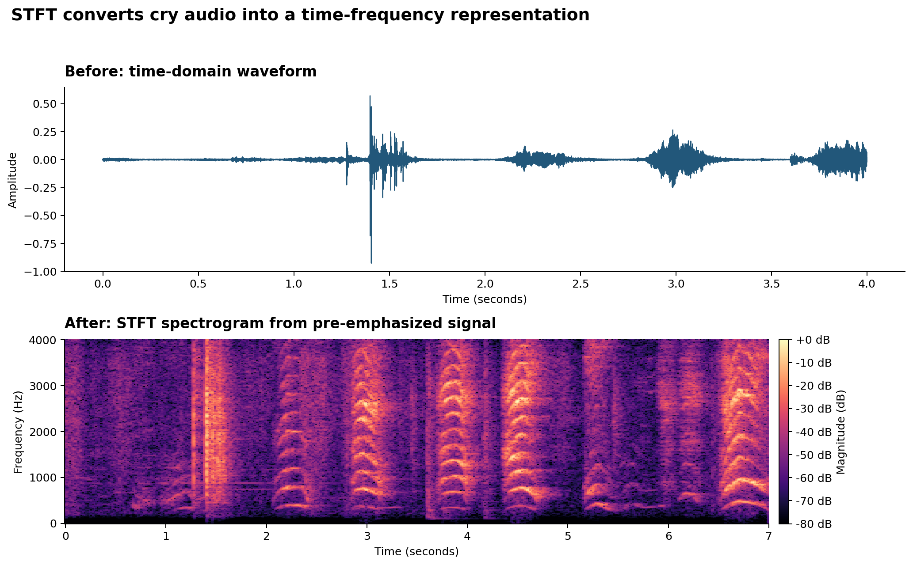
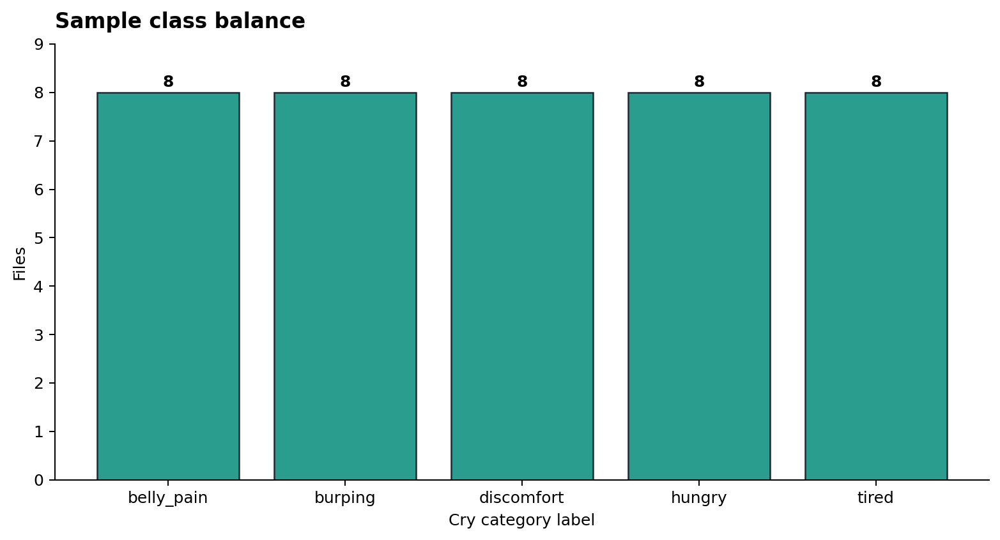
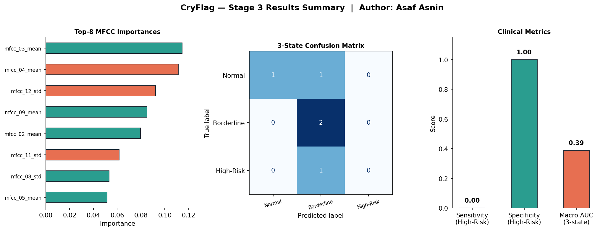

# CryFlag - Neonatal Cry Acoustics Clinical AI Decision Support


An end-to-end medical AI MVP by **Asaf Asnin** that transforms neonatal cry recordings into lightweight acoustic features, trains a CPU-friendly XGBoost model, and maps model probabilities into a simple 3-state clinical support output.

The goal is not to build a heavy model. The goal is to demonstrate the reasoning and engineering behind a responsible medical AI product: clear clinical framing, reproducible data handling, transparent preprocessing, simple modeling, and cautious user-facing output.

## Clinical Problem

Newborn crying can indicate routine needs, mild distress, or stronger pain/stress signals. In busy neonatal care settings, nurses need fast screening support that can help flag cries that may deserve closer attention.

**CryFlag** explores neonatal cry acoustics as a decision-support tool for screening possible pain/stress patterns from short audio clips.

Target workflow: **Screening / Decision Support**

Target user: **Nurse or clinical staff member**

Final output:

1. **Normal**
2. **Borderline–Suspicious**
3. **High-Risk**

The system never presents a bare probability as the final result. It converts model evidence into a human-readable clinical flag.

## What This Repository Demonstrates

- Public, accessible audio data from the Donate-a-Cry corpus.
- Deterministic data acquisition and metadata generation.
- A clear Lecture 4 preprocessing pipeline: pre-emphasis, STFT spectrogram, MFCC extraction.
- Before/after plots that explain how raw audio becomes model-ready data.
- Two simple models compared on engineered audio features.
- XGBoost selected as the primary lightweight model.
- A clinical 3-state output layer designed for screening support.
- A polished author-named MVP notebook that runs top-to-bottom on CPU and documents all four mandated course stages.

## Final Notebook

The main deliverable is:

```text
Asaf_Asnin_Neonatal_Cry_AI_MVP.ipynb
```

The notebook is structured as a complete clinical product story:

- **Executive Summary**: CryFlag product overview, target user, input, output, and clinical workflow.
- **Stage 1**: clinical problem, product specification, user flow, and functional/non-functional requirements.
- **Stage 2**: dataset source, preprocessing rationale, and before/after visual evidence.
- **Stage 3**: XGBoost vs. MLP comparison, metric selection, and 3-state threshold logic.
- **Stage 4**: MVP completion checklist and submission summary.

It contains 29 cells, uses fixed seed `42`, and runs top-to-bottom on a laptop CPU in seconds.

## Data Source

Dataset: [Donate-a-Cry Corpus](https://github.com/gveres/donateacry-corpus)

Local sample used in this MVP:

| Property | Value |
|---|---:|
| Audio files | 40 |
| Labels | 5 |
| Files per label | 8 |
| Source sample rate | 8,000 Hz |
| Channels | Mono |
| Mean duration | 6.92 seconds |
| Split | 30 train / 5 validation / 5 test |

This is a deliberately small classroom MVP sample — the maximum balanced size the public Donate-a-Cry corpus supports (the `burping` label only has 8 files total). It is useful for demonstrating the full pipeline, not for claiming production-level performance; see the notebook's multi-seed sweep and honest success-criteria check for a quantified discussion of that limitation.

The dataset is hosted on public GitHub rather than Kaggle or PhysioNet — it still meets the "public + accessible, license documented" bar via `raw.githubusercontent.com` access and its ODbL/DbCL license.

## Visual Data Pipeline

### 1. Raw Neonatal Cry Waveform


The raw waveform shows how the cry arrives as a time-domain signal: bursts, pauses, and amplitude changes over seconds. This is the starting point before any machine learning feature extraction.

### 2. Before/After: Pre-Emphasis Filter


Pre-emphasis balances the acoustic spectrum by highlighting fast changes in the cry signal. This helps make sharp cry events and harmonic structure more visible before spectral analysis.

### 3. Before/After: STFT Spectrogram



The STFT spectrogram converts the waveform into a time-frequency view. Instead of only seeing "how loud" the cry is, we can inspect where energy appears across frequency bands over time.

### 4. Before/After: MFCC Feature Map


MFCC extraction compresses the spectrogram into a compact acoustic representation. This keeps the model lightweight while preserving useful information about the cry's spectral envelope.

### 5. Before/After: Per-Coefficient Normalization


Each MFCC coefficient is z-scored across time before pooling, removing recording-level loudness bias (microphone gain, distance from the infant) so the model compares cry shape rather than cry volume.

### 6. Sample Class Balance



The MVP sample is intentionally balanced: eight files from each corpus label — the maximum balanced size available from the source corpus. This makes the pipeline easy to inspect and keeps the notebook fast enough for CPU execution.

## Model Architecture & Results

The model layer uses engineered MFCC features:

- 13 MFCC means
- 13 MFCC standard deviations
- 26 total acoustic features per audio file (post z-score normalization)

Three models are compared:

| Model | Role | Why Included |
|---|---|---|
| XGBoost | Primary model | Strong fit for small tabular feature sets, fast CPU training, feature-importance support |
| MLP baseline | Comparison model | Simple neural baseline within the lightweight project stack — the correct like-for-like substitute for a 1D CNN once MFCC pooling removes the time axis |
| DummyClassifier | Sanity-check floor | Majority-class guess; not a real candidate, just proof the real models beat chance |

XGBoost is selected as the primary model because it is practical for small engineered-feature datasets, trains in seconds on a laptop CPU, and exposes feature importances for clinical interpretability.

### XGBoost Result Visual



This figure shows the final modeling stage: the top MFCC features used by XGBoost, the 3-state confusion matrix, and the final screening metrics on the held-out test split.

### Final Evaluation Metrics

Current MVP metrics on the 5-file test split (seed=42 primary run):

| Metric | Value | Interpretation |
|---|---:|---|
| High-Risk sensitivity | 0.00 | The single High-Risk test file was not correctly flagged in this run. |
| High-Risk specificity | 1.00 | All non-High-Risk test files were correctly kept out of High-Risk. |
| Clinical-state macro AUC | 0.39 | AUC after collapsing the five corpus labels into the 3-state clinical output. |
| 5-class macro AUC | 0.50 | AUC from the 5-label XGBoost model comparison. |

The notebook pre-registers numeric success criteria (macro AUC ≥ 0.60, High-Risk sensitivity ≥ 0.50, beating a DummyClassifier baseline) **before** showing these numbers, then reports honestly that they are not met on this run — tied explicitly to a 5-seed stability sweep showing the same instability. These results are reported transparently rather than softened: the current dataset sample (40 files, the corpus's balanced maximum) is too small for reliable model performance, but it is sufficient to demonstrate the complete, rigorously self-evaluated MVP: data acquisition, audio preprocessing, model training, multi-seed stability checking, error analysis, robustness checking, evaluation, and 3-state output logic.

## 3-State Clinical Logic

The model first predicts probabilities over five corpus labels. Those probabilities are then collapsed into three clinical support states:

| Corpus label | Clinical state |
|---|---|
| `hungry`, `tired` | `1. Normal` |
| `burping`, `discomfort` | `2. Borderline–Suspicious` |
| `belly_pain` | `3. High-Risk` |

Threshold logic:

- If `P(High-Risk) >= 0.30`, flag **High-Risk**.
- Else if `P(Normal) >= 0.55`, assign **Normal**.
- Otherwise, assign **Borderline–Suspicious**.

This conservative design favors nurse review for uncertain cases instead of clearing ambiguous cry patterns too quickly.

## Repository Structure

```text
.
├── data_loader.py                 # Download/sample WAV files and create metadata
├── preprocess.py                  # Pre-emphasis, STFT, MFCC extraction, figures
├── models.py                      # XGBoost and MLP model comparison
├── classify.py                    # 3-state clinical output mapping
├── Asaf_Asnin_Neonatal_Cry_AI_MVP.ipynb  # End-to-end final notebook
├── data_report.md                 # Stage 2 data report
├── project_development_log.md     # Project journal and technical decisions
├── data/
│   ├── metadata.csv
│   └── processed/mfcc_features.csv
└── figures/
    ├── 01_before_raw_waveform.png
    ├── 02_before_after_pre_emphasis.png
    ├── 03_before_after_stft_spectrogram.png
    ├── 04_before_after_mfcc.png
    ├── 05_before_after_normalization.png
    ├── 06_sample_class_balance.png
    └── 06_xgboost_results.png
```

## How To Run

Create and activate a virtual environment:

```bash
python3 -m venv .venv
source .venv/bin/activate
```

Install dependencies:

```bash
pip install -r requirements.txt
```

Regenerate the data sample and preprocessing outputs:

```bash
python data_loader.py acquire --samples-per-label 4 --seed 42
python preprocess.py
```

Open the MVP notebook:

```bash
jupyter notebook Asaf_Asnin_Neonatal_Cry_AI_MVP.ipynb
```

Then run all cells from top to bottom.

macOS note: if XGBoost cannot load OpenMP, install the runtime with:

```bash
brew install libomp
```

## Current MVP Results

The notebook runs top-to-bottom on CPU in seconds. Because the local sample has only 40 audio files (the corpus's balanced maximum), the model results are best understood as a pipeline demonstration rather than performance evidence — quantified honestly via the pre-registered success criteria and multi-seed stability sweep inside the notebook.

The important result is the complete workflow:

```text
Raw audio -> pre-emphasis -> STFT -> MFCC features -> XGBoost -> 3-state clinical flag
```

## Responsible Use

This project is an educational MVP for an Applied Machine Learning in Medicine course. It is designed to assist screening workflows and demonstrate product thinking, not to replace clinical judgment.
