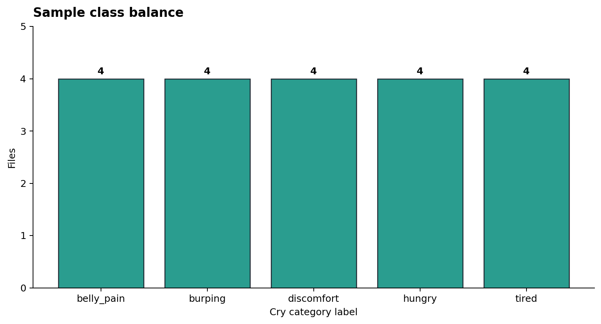

# Data Report: Neonatal Cry Acoustics

## Scope

This report covers the Codex-owned data layer only: data acquisition, loading, deterministic preprocessing, before/after visuals, and a ready-to-model feature table. Model choice, metric justification, thresholds, and the final 3-state clinical output remain Claude-owned.

## Dataset

Source: [gveres/donateacry-corpus](https://github.com/gveres/donateacry-corpus)

Subset used: `donateacry_corpus_cleaned_and_updated_data`

Access: public GitHub repository; the sample is downloaded directly from `raw.githubusercontent.com` by `data_loader.py`.

License noted by the source repository: Open Database License (ODbL) for the database and Database Contents License (DbCL) for individual contents.

Important data caveat: the repository describes the files as user-uploaded mobile-app audio with contributor-provided tags. For this course project, the data layer treats labels as corpus labels only and does not treat them as verified clinical truth.

## Local Sample

The current workspace contains a deterministic balanced sample:

| Item | Value |
|---|---:|
| WAV files | 20 |
| Labels | 5 |
| Files per label | 4 |
| Train files | 10 |
| Validation files | 5 |
| Test files | 5 |
| Source sample rate | 8,000 Hz |
| Channels | 1 mono |
| Audio subtype | PCM 16-bit |
| Duration range | 6.54-7.06 seconds |
| Mean duration | 6.93 seconds |

Class balance:

| Label | Files |
|---|---:|
| `belly_pain` | 4 |
| `burping` | 4 |
| `discomfort` | 4 |
| `hungry` | 4 |
| `tired` | 4 |

Split policy: fixed seed `42`, stratified by corpus label. With 4 files per label, each label contributes 2 train, 1 validation, and 1 test file.

Generated files:

- `data/metadata.csv`: one row per audio file with source path, local path, label, split, age tag, gender tag, sample rate, duration, format, and file size.
- `data/processed/mfcc_features.csv`: one row per audio file with 13 MFCC means and 13 MFCC standard deviations.
- `figures/`: before/after preprocessing visuals.

## Data Quality Notes

Missing values: none found in the generated metadata.

Duration outliers: none in the sampled files. All files are short neonatal cry clips between 6.54 and 7.06 seconds.

Format consistency: all sampled files are mono WAV, 8 kHz, PCM 16-bit. Because the source sample rate is consistent, preprocessing keeps 8 kHz rather than artificially upsampling.

Label limitation: the sample is intentionally balanced for a small classroom MVP. It should not be presented as the natural label distribution of the full public corpus.

## Lecture 4 Preprocessing Pipeline

### Step 1: Audio Loading and Sampling-Rate Check

Implementation: `librosa.load(..., sr=8000, mono=True)`.

Reasoning: the sampled source files are already 8 kHz mono. Keeping that rate preserves the real recorded bandwidth, keeps processing CPU-light, and avoids displaying empty high-frequency bands that would appear after unnecessary upsampling.

Visual:


### Step 2: Pre-Emphasis Filter

Implementation:

```text
y[t] = x[t] - 0.97 * x[t-1]
```

Reasoning: mobile recordings can contain low-frequency handling noise and large slow amplitude swings. Pre-emphasis highlights fast acoustic changes and cry harmonics while preserving the timing of cry bursts. This is useful before spectral analysis because it makes short high-frequency events more visible.

Before/After visual:


### Step 3: STFT Spectrogram

Implementation: Hann-window STFT with `n_fft=512` and `hop_length=128`.

At 8 kHz this is a 64 ms analysis window with a 16 ms hop. That is short enough to show changing cry bursts while still providing a readable frequency structure for the report.

Reasoning: a waveform shows amplitude over time, but cry audio changes in both time and frequency. The STFT spectrogram converts the signal into a compact time-frequency representation that can be inspected visually and used as a clear intermediate data product.

Before/After visual:


### Step 4: MFCC Extraction

Implementation: 13 MFCC coefficients from the pre-emphasized signal using the same STFT window and hop.

Reasoning: MFCCs summarize the spectral envelope into a small feature vector. For a lightweight CPU-trainable project, MFCC mean and standard deviation features are much smaller than raw spectrogram pixels while still preserving useful acoustic structure.

Before/After visual:


## Ready-to-Model Output

The current feature table is:

```text
data/processed/mfcc_features.csv
```

Shape: 20 rows x 32 columns.

Columns include:

- `path`, `filename`, `label`, `split`
- `sample_rate`, `n_frames`
- `mfcc_01_mean` through `mfcc_13_mean`
- `mfcc_01_std` through `mfcc_13_std`

This table is deterministic and suitable for Claude's next stage: simple model comparison and downstream 3-state mapping.

## Presentation Figures



Recommended figure order for Stage 2 slides:

1. Raw waveform: `figures/01_before_raw_waveform.png`
2. Pre-emphasis before/after: `figures/02_before_after_pre_emphasis.png`
3. STFT before/after: `figures/03_before_after_stft_spectrogram.png`
4. MFCC before/after: `figures/04_before_after_mfcc.png`
5. Sample class balance: `figures/05_sample_class_balance.png`
